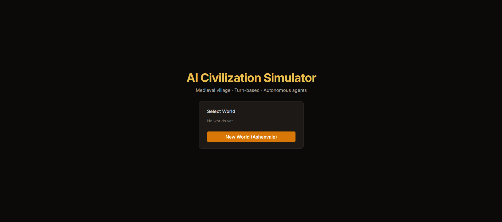
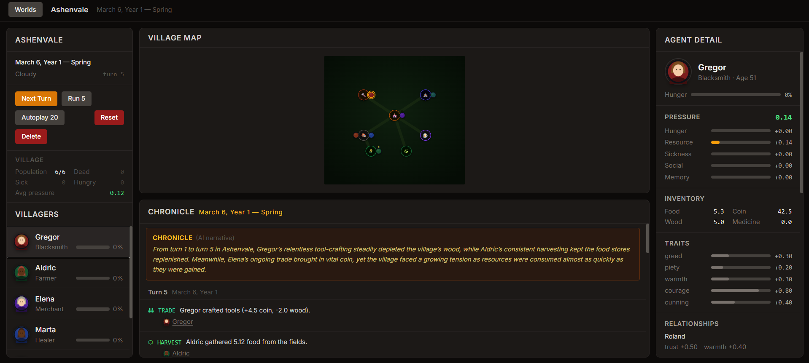
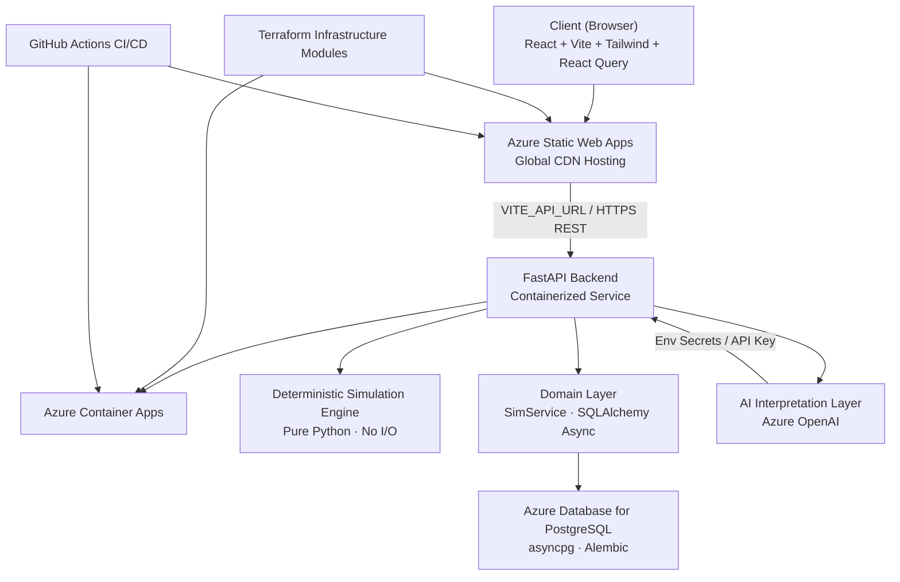

# AI Civilization Simulator

<p align="center">
  
  
  
</p>

AI Civilization Simulator is a production-shaped full-stack platform that explores how deterministic simulation systems can be augmented with selective large-language-model reasoning without sacrificing reproducibility.

The system demonstrates modern cloud deployment patterns, domain-driven backend design, and AI integration as an optional interpretation layer rather than core decision logic.

---

## Live Demo

**Frontend:** https://thankful-bay-0486ec70f.2.azurestaticapps.net  
**API Docs:** https://aca-civsim-api.livelycoast-caf3a2f0.eastus2.azurecontainerapps.io/docs  

> Demo world **“Ashenvale”** is pre-seeded. Run turns, interrogate agents, and watch the village evolve in real time.

---

## System Overview

This project explores how **deterministic simulation systems can be augmented with selective large-language-model reasoning** without introducing non-determinism into core game logic.

The goal was to design a production-shaped platform that demonstrates:

- cloud-portable backend architecture  
- testable domain modeling  
- AI as an optional interpretation layer  
- full lifecycle deployment using modern platform engineering practices  

---

## Screenshots

### Dashboard



### Simulation



---

## What It Does

Each simulation turn runs a deterministic multi-stage pipeline across every agent in the village. Agents farm, trade, craft, heal, patrol, and die — driven by resource pressure, social relationships, seasonal cycles, and occupational risk.

When high-impact events occur, Azure OpenAI generates narrative responses in the voice of affected agents.

### Key Capabilities

- **Autonomous agents** — multiple professions, persistent memories, relationship graphs, health/hunger/pressure stats  
- **AI narrative layer** — selective interpretation of high-drama events and in-character agent Q&A  
- **Deterministic simulation** — fully reproducible turns; AI is additive rather than load-bearing  
- **Timeline persistence** — every event stored; agents remember past interactions and losses  
- **Production-grade infrastructure** — Terraform modules, GitHub Actions CI/CD, containerized deployment  
- **Comprehensive automated testing**
  - deterministic engine unit tests  
  - async API integration tests  
  - AI layer contract tests  
  - frontend interaction tests  

---

## Architecture



---

### Deployment Strategy

The platform is deployed live on Azure using containerized infrastructure and environment-driven configuration.

The backend container is cloud-agnostic and designed for reproducible deployment across managed compute platforms. Terraform modules exist for:

- Azure Container Apps *(live deployment)*  
- Google Cloud Run *(infrastructure module implemented)*  
- AWS App Runner / ECS Fargate *(infrastructure module implemented)*  

This allows the system to be redeployed across providers without application code changes.

---

## Simulation Engine

The engine is a **pure Python deterministic pipeline** — no database, no async, no I/O.

```
Turn N pipeline (11 stages):
season_tick → agent_refresh → economy_opportunities
→ [AI decision support hook] → resolve_actions → trade_resolution
→ social_update → pressure_compute → world_events
→ memory_write → chronicle_format
```

### Performance Characteristics

- Turn execution is primarily CPU-bound  
- Engine can be parallelized across worlds or batched turn runs  
- Database writes occur after simulation completion  
- AI calls are rate-limited and executed outside the critical simulation path  

---

## AI Integration

Azure OpenAI acts as a **selective interpretation layer**.

- `AI_ENABLED=false` by default — simulation runs fully offline  
- Chronicle entries generated for high-impact events  
- Agent Q&A endpoint returns in-character responses  
- Structured context builder composes memory + stats + relationships  
- Cost control via configurable call caps  

---

## Observability Strategy

The platform is designed for production observability:

- structured logging at domain boundaries  
- async request lifecycle tracing hooks  
- future OpenTelemetry integration planned  
- simulation stage timing metrics for performance analysis  

---

## Production Considerations

- deterministic simulation enables reproducible debugging and replay  
- AI calls are rate-limited and executed outside the critical simulation path  
- containerized deployment supports horizontal scaling across worlds  
- database writes occur after simulation resolution to minimize contention  
- infrastructure is provisioned via Terraform for environment parity

---

## Tech Stack

### Backend

| Layer | Technology |
|---|---|
| Runtime | Python 3.13 |
| Framework | FastAPI |
| ORM | SQLAlchemy 2.0 (async) |
| Database | PostgreSQL (asyncpg) |
| Migrations | Alembic |
| AI | Azure OpenAI |
| Testing | pytest + pytest-asyncio |

### Frontend

| Layer | Technology |
|---|---|
| Framework | React 18 + TypeScript |
| Build | Vite |
| Styling | Tailwind CSS |
| State | TanStack React Query |
| Testing | Vitest + RTL |

### Platform

| Layer | Technology |
|---|---|
| Containers | Docker |
| IaC | Terraform |
| CI/CD | GitHub Actions |
| Frontend Hosting | Azure Static Web Apps |
| Backend Hosting | Azure Container Apps |
| Database | Azure PostgreSQL |

---

## Local Development

```bash
docker compose up -d

cd backend
uv sync
uv run alembic upgrade head
uv run python seed/village_seed.py
uv run uvicorn app.main:app --reload

cd ../frontend
npm install
npm run dev
```

---

## API Surface

```
GET    /api/worlds
POST   /api/worlds
DELETE /api/worlds/{id}
POST   /api/worlds/{id}/turns/next
POST   /api/worlds/{id}/turns/run
POST   /api/worlds/{id}/reset

GET    /api/worlds/{id}/agents
POST   /api/worlds/{id}/agents/{id}/ask
GET    /api/worlds/{id}/timeline
```

---

## Roadmap

- WebSocket live updates  
- Parallel simulation workers  
- Replay mode / historical timeline viewer  
- Agent personality evolution  
- Inter-village trade routes  
- Full OpenTelemetry instrumentation  
- Optional multi-cloud deployment validation
